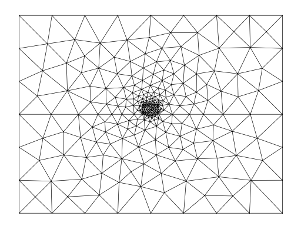
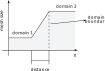

(chapter-mesh)=
# Meshing in Femwell

Meshing can be done in femwell and actually it provides some routines for setting up the typical mesh for a waveguide cross-section. These routines are contained in the package `femwell.mesh`.

Femwell meshing routines are based on external meshing and geometry libraries among which we find

- [`gmsh`](https://gmsh.info/), a well-known open source library for generation of finite element mesh generation;
- [`pygmsh`](https://github.com/nschloe/pygmsh), python library providing wrapping many features of gmsh and easing its use in Python
- [`shapely`](https://github.com/shapely/shapely), python library providing routines for geometric objects analysis and manipulation.

The entry point for meshing in femwell is the routine `mesh_from_OrderedDict` available in `femwell.mesh`. This one accepts a `OrderedDict` object specifying the geometrical entities  the cross-section is composed and performs the following actions

- run gmsh
- write the gmsh mesh to a temporary file
- load the mesh with scikit-fem for use in the finite element assembly

A practical example defining a buried waveguide is the following

```python
wg_width = 0.5
wg_thickness = 0.3
box_width = 8
box_heigth = 6
core = shapely.geometry.box(-wg_width / 2, 0, +wg_width / 2, wg_thickness)
cladding = shapely.geometry.box(-box_width/2, -box_heigth/2, box_width/2, box_heigth/2)
env = cladding
# env = shapely.affinity.scale(core.buffer(5, resolution=8), xfact=0.5)

polygons = OrderedDict(
    core=core,
    box=clip_by_rect(env, -np.inf, -np.inf, np.inf, 0),
    clad=clip_by_rect(env, -np.inf, 0, np.inf, np.inf),
)

resolutions = dict(core={"resolution": 0.05, "distance": 0.05})

mesh = from_meshio(mesh_from_OrderedDict(polygons, resolutions, default_resolution_max=10))
mesh.draw().show()
```



In case of overlapping polygons, femwell operate in a similar way to [Lumerical](https://optics.ansys.com/hc/en-us/articles/360034915233-Understanding-mesh-order-for-overlapping-objects) and gives priority to the shapes defined first in the dictionary passed to `mesh_from_OrderedDict`. For example in the code snippet above, the core and the cladding overlap, but core shape have the priority because it comes first in the `polygons` dictionary.

## Controlling the mesh size

In femwell you can control mesh size by specifying up to two parameters for every polygon:

- `resolution`, determining the target mesh size for that polygon in micrometers [um] (as all distances in femwell
- `distance`, controlling how the mesh size varies between two region with different `resolution` parameters. Specifically, in femweel the mesh size smoothly change between two regions as shown in the figure below. The distance parameter control how long the transition between two regions with different mesh size is.



If the user does not specify a resolution for a domain, femwell set the minimum and the maximum mesh size to 1E-12 and 0.5 microns respectively. These default values can be overriden by setting the parameters `default_resolution_min` and `default_resolution_max` of `mesh_from_OrderedDict`.

For example in the previous code snippet, the size of the core waveguide was set by definining 

```python
resolutions = dict(core={"resolution": 0.05, "distance": 0.05})

mesh = from_meshio(mesh_from_OrderedDict(polygons, resolutions, default_resolution_max=10))
```

For more detailed information on how the mesh size is determined, you can refer to the this [official gshm example](https://gmsh.info/doc/texinfo/gmsh.html#t10)

## Physical region

Up to now femwell support only homogenously filled materials with constant refractive index (there is no support for graded, continously varying materials). Every material region correspond to a *physical interface* and These physical interfaces coincide with the polynomials passed to `mesh_from_OrderedDict`. So if we define three polygons: core, box and cladding as in the previous example, then three different physical interfaces with the same name will be created.

## Custom Meshes

Since femwell its modular, it accepts every mesh loaded into scikit-fem. You just need to replace mesh_from_OrderedDict and load the mesh you generated yourself using a code like this

```python
mesh = from_meshio(meshio.read("custom_mesh.msh"))
```